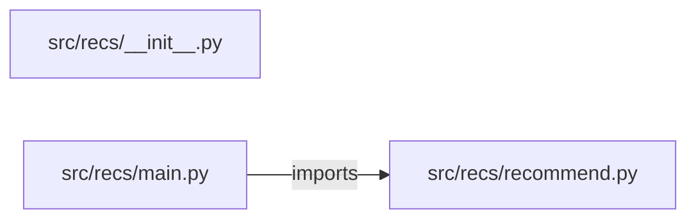

# recommendation-engine — project architecture

[README](README.md) · [Interview questions and answers](INTERVIEW_QA.md)

## Purpose and scope

recommendation engine repository.

This document describes files and symbols in this checkout. Deployment templates and statements in the original overview are distinguished from a verified running environment.

## Component diagram



For Python repositories, arrows show resolved local imports, not network calls or deployment order. Otherwise the diagram is a repository component map; containment arrows do not assert runtime integration.

## Components and responsibilities

| Component | Responsibility |
| --- | --- |
| [`src/recs/main.py`](src/recs/main.py) | HTTP handlers: `GET /healthz`, `GET /catalog`, `POST /recommend`, `GET /users/{user}/recommendations`, `POST /ratings` |
| [`src/recs/recommend.py`](src/recs/recommend.py) | Functions: `reset`, `cosine`, `recommend`, `item_vector`, `item_similarity`, `rate`, `popular` |
| [`requirements.txt`](requirements.txt) | Implementation or supporting configuration |
| [`src/recs/__init__.py`](src/recs/__init__.py) | Implementation or supporting configuration |
| [`tests/test_recommend.py`](tests/test_recommend.py) | Executable checks and regression examples |
| [`.github/workflows/ci.yml`](.github/workflows/ci.yml) | GitHub Actions job definitions |
| [`README.md`](README.md) | Project explanations or operating notes |

## Request interface

| Method and path | Handler | Source |
| --- | --- | --- |
| `GET /healthz` | `healthz` | [`src/recs/main.py`](src/recs/main.py#L16) |
| `GET /catalog` | `catalog` | [`src/recs/main.py`](src/recs/main.py#L21) |
| `POST /recommend` | `post_recommend` | [`src/recs/main.py`](src/recs/main.py#L26) |
| `GET /users/{user}/recommendations` | `user_recommendations` | [`src/recs/main.py`](src/recs/main.py#L31) |
| `POST /ratings` | `post_rating` | [`src/recs/main.py`](src/recs/main.py#L36) |
| `GET /popular` | `get_popular` | [`src/recs/main.py`](src/recs/main.py#L41) |

The table lists literal route decorators found in the inspected Python modules. Router prefixes and middleware can add behavior; check the linked handler and application setup before calling an endpoint.

## Implementation walkthrough

### `for_user(user, k=3)`

Source: [`src/recs/recommend.py`](src/recs/recommend.py#L84).

Calls visible in this function: `RATINGS.get`, `RecError`, `isinstance`, `item_similarity`, `len`, `max`, `popular`, `positive.items`, `positive.values`, `ranked.append`, `ranked.sort`, `round`.

```python
def for_user(user, k=3):
    if not isinstance(k, int) or not 1 <= k <= len(CATALOG):
        raise RecError(f"k must be from 1 to {len(CATALOG)}")
    rated = RATINGS.get(user, {})
    if not rated:
        return {"user": user, "strategy": "popular", "recommendations": popular(k=k)}
    ranked = []
    for candidate in CATALOG:
        if candidate in rated:
            continue
        sims = {item: item_similarity(candidate, item) for item in rated}
        positive = {item: sim for item, sim in sims.items() if sim > 0}
        if not positive:
            continue
        support = sum(positive.values())
        predicted = sum(sim * rated[item] for item, sim in positive.items()) / support
        liked = {item: sim for item, sim in positive.items() if rated[item] >= LIKED}
        because = max(liked, key=lambda item: (liked[item], item)) if liked else None
        ranked.append({"item": candidate, "predicted": round(predicted, 4), "support": round(support, 4), "because": because})
    ranked.sort(key=lambda row: (-row["predicted"], -row["support"], row["item"]))
    if not ranked:
        return {"user": user, "strategy": "popular", "recommendations": popular(exclude=rated, k=k)}
```

The excerpt is truncated; the linked source contains the full implementation.

### `recommend(item)`

Source: [`src/recs/recommend.py`](src/recs/recommend.py#L40).

Calls visible in this function: `CATALOG.items`, `RecError`, `cosine`, `ranked.append`, `ranked.sort`, `round`.

```python
def recommend(item):
    if item not in CATALOG:
        raise RecError(f"unknown catalog item: {item}")
    chosen = CATALOG[item]
    ranked = []
    for name, vector in CATALOG.items():
        if name == item:
            continue
        ranked.append({"item": name, "score": round(cosine(chosen, vector), 4)})
    ranked.sort(key=lambda row: (-row["score"], row["item"]))
    return {"item": item, "recommendations": ranked}
```

### `popular(exclude=(), k=3)`

Source: [`src/recs/recommend.py`](src/recs/recommend.py#L72).

Calls visible in this function: `RATINGS.values`, `len`, `round`, `stats.append`, `stats.sort`, `sum`.

```python
def popular(exclude=(), k=3):
    stats = []
    for item in CATALOG:
        if item in exclude:
            continue
        scores = [ratings[item] for ratings in RATINGS.values() if item in ratings]
        mean = sum(scores) / len(scores) if scores else 0.0
        stats.append({"item": item, "ratings": len(scores), "mean": round(mean, 4)})
    stats.sort(key=lambda row: (-row["ratings"], -row["mean"], row["item"]))
    return stats[:k]
```

### `rate(user, item, rating)`

Source: [`src/recs/recommend.py`](src/recs/recommend.py#L61).

Calls visible in this function: `RATINGS.setdefault`, `RecError`, `dict`, `isinstance`, `len`, `user.isidentifier`.

```python
def rate(user, item, rating):
    if not isinstance(user, str) or not user.isidentifier() or len(user) > 40:
        raise RecError("user must be a short identifier")
    if item not in CATALOG:
        raise RecError(f"unknown catalog item: {item}")
    if not isinstance(rating, int) or isinstance(rating, bool) or not 1 <= rating <= 5:
        raise RecError("rating must be an integer from 1 to 5")
    RATINGS.setdefault(user, {})[item] = rating
    return {"user": user, "ratings": dict(RATINGS[user])}
```

## Validation and failure paths

| Explicit exception | Source |
| --- | --- |
| `HTTPException(status_code=422, detail=str(exc))` | [`src/recs/main.py`](src/recs/main.py#L12) |
| `RecError(f'unknown catalog item: {item}')` | [`src/recs/recommend.py`](src/recs/recommend.py#L42) |
| `RecError('user must be a short identifier')` | [`src/recs/recommend.py`](src/recs/recommend.py#L63) |
| `RecError(f'unknown catalog item: {item}')` | [`src/recs/recommend.py`](src/recs/recommend.py#L65) |
| `RecError('rating must be an integer from 1 to 5')` | [`src/recs/recommend.py`](src/recs/recommend.py#L67) |
| `RecError(f'k must be from 1 to {len(CATALOG)}')` | [`src/recs/recommend.py`](src/recs/recommend.py#L86) |

These are explicit exceptions in the inspected source, rather than a claim that every failure is handled. Follow the calling handler to see whether the exception becomes an HTTP response or propagates.

## Data and state

- [`src/recs/recommend.py`](src/recs/recommend.py) defines module-level containers: `CATALOG`, `SEED_RATINGS`.

Module-level dictionaries/lists live in a Python process. They can be fixtures or mutable state; inspect writes before treating them as persistent storage. A production extension would need to define persistence and concurrency behavior explicitly.

## Data flow and design decisions

### What is the input-to-output contract of `for_user`

In [`src/recs/recommend.py`](src/recs/recommend.py#L84), `for_user(user, k=3)` receives the inputs. The function computes these intermediate values:

- `rated = RATINGS.get(user, {})`
- `ranked = []`

Its result is defined by:

- `{'user': user, 'strategy': 'item_based', 'recommendations': ranked[:k]}`
- `{'user': user, 'strategy': 'popular', 'recommendations': popular(k=k)}`
- `{'user': user, 'strategy': 'popular', 'recommendations': popular(exclude=rated, k=k)}`

### Which decision rules or boundary conditions should an interviewer challenge

The implementation in [`src/recs/recommend.py`](src/recs/recommend.py#L84) branches on:

- `not isinstance(k, int) or not 1 <= k <= len(CATALOG)`
- `not rated`
- `not ranked`
- `candidate in rated`
- `not positive`

A useful extension is a table-driven test that covers each condition just below, at, and above its boundary where applicable. These expressions are the current rules; changing them changes behavior and should be justified by the project’s acceptance criteria.

## Setup and verification

The following commands are derived from the checked-in dependency/test contracts. Execute them from the repository root; the block prepares a local environment, not a cloud deployment.

```bash
python3 -m venv .venv
source .venv/bin/activate
python -m pip install -r requirements.txt
python -m pytest -q
```

Python dependencies: [`requirements.txt`](requirements.txt).

Test entry points: [`tests/test_recommend.py`](tests/test_recommend.py).

Automation definitions: [`.github/workflows/ci.yml`](.github/workflows/ci.yml). Read their triggers and job steps to determine what CI actually runs.

## Operating boundaries and design review

Before turning this checkout into a customer deployment, establish the input contract, data ownership, access controls, failure response, evaluation criteria, and rollback owner. Repository fixtures and unit tests demonstrate local behavior; they do not establish throughput, uptime, compliance, or business impact.

A useful architecture review starts with the linked implementation: identify where input enters, where a decision is made, which state can change, and which external dependency can fail. Add a deployment view only for infrastructure that is actually configured and exercised.
